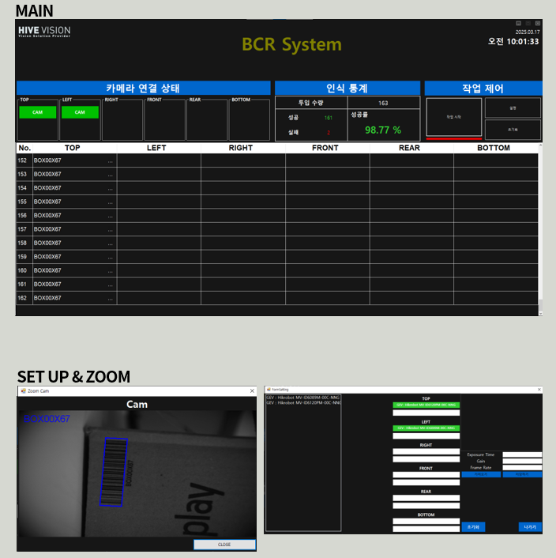

# 📦 Multi-Channel Barcode Reader

## 📘 프로젝트 소개
6면 검사 기준으로 최대 12채널까지 지원하는 **멀티 바코드 리더기 프로그램**입니다.  
각 카메라(또는 리더기)에서 디코딩된 데이터를 멀티 스레드 방식으로 처리하고,  
프로그램 종료 시 CSV 파일로 결과를 자동 저장하도록 설계되었습니다.

---

## 🧰 기술 스택
- **C# (WinForms)**
- **MVCCodeReader SDK**

---

## ⚙️ 주요 기능
- 최대 **12채널 바코드 스캐너 동시 운영** (멀티 스레드 처리)
- 스캔 결과의 **예외 캡처 및 상세 로그 기록**
- 프로그램 종료 시 **디코딩 데이터 CSV 파일 자동 저장**

---

💼 수행 업무
- 단독 개발

---

## 🧩 프로젝트 구조
```markdown
BarcodeReader/
├── Device/
│ ├── CodeReaderManager.cs
│ └── LogManager.cs
├── Process/
│ ├── ReaderProcess.cs
│ └── CsvExporter.cs
└── UI/
├── MainForm.cs
└── LogViewerForm.cs
```

---

## 🔍 프로젝트 회고
초기에는 모든 카메라 채널의 스캔 완료 여부를  
**bool 배열로 관리하며 멀티 스레드로 접근**했습니다.  
그러나 스레드 간 동기화가 이루어지지 않아 일부 채널의 값이 정상적으로 반영되지 않는 문제가 발생했습니다.  

이를 해결하기 위해 **`lock` 구문을 적용**하여 공유 자원 접근 시 스레드 간 충돌을 방지하였고,  
이후 모든 채널의 상태가 안정적으로 동기화되어 정상 동작을 확인했습니다.

---

## 🖼️ 프로그램 UI

